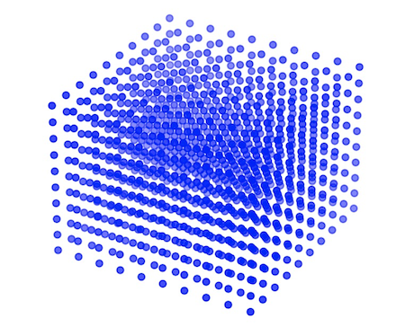

<h1 align="center">numgrids</h1>
<p align="center"> Working with numerical grids made easy. </p>

<p align="center"><a href="https://badge.fury.io/py/numgrids"> </a> <a href=""> </a><a href="https://codecov.io/gh/maroba/numgrids"> </a> <a href="https://maroba.github.io/numgrids/"></a></p>

  <div align="center">   </div>

**Main Features**

- Quickly define numerical grids for any rectangular or curvilinear coordinate system
- Built-in **spherical**, **cylindrical**, and **polar** coordinate grids
- **Vector calculus operators**: gradient, divergence, curl, and Laplacian on curvilinear grids
- Differentiation and integration
- Interpolation
- Easy manipulation of meshed functions
- Using high precision spectral methods (FFT + Chebyshev) wherever possible
- Includes multigrid functionality
- Fully compatible with *numpy*

## Installation

```shell
pip install --upgrade numgrids
```

## Documentation

Full documentation including API reference and example notebooks is available at
**[maroba.github.io/numgrids](https://maroba.github.io/numgrids/)**.

## Quick Start

As a quick example, here is how you define a grid on the unit disk using polar coordinates.
Along the azimuthal (angular) direction, choose an equidistant spacing with periodic boundary conditions:

```python
from numgrids import *
from numpy import pi

axis_phi = create_axis(AxisType.EQUIDISTANT, 50, 0, 2*pi, periodic=True)
```


Along the radial axis, let's choose a non-equidistant spacing:

```python
axis_radial = create_axis(AxisType.CHEBYSHEV, 20, 0, 1)
```


Now combine the axes to a **grid**:

```python
grid = Grid(axis_radial, axis_phi)
```


**Sample** a meshed function on this grid:

```python
from numpy import exp, sin

R, Phi = grid.meshed_coords
f = R**2 * sin(Phi)**2
```
Define **partial derivatives** $\partial/\partial r$ and $\partial/\partial \varphi$ and apply them:

```python
# second argument means derivative order, third argument means axis index:
d_dr = Diff(grid, 1, 0) 
d_dphi = Diff(grid, 1, 1)

df_dr = d_dr(f)
df_dphi = d_dphi(f)
```

Obtain the **matrix representation** of the differential operators:

```python
d_dr.as_matrix()

Out: <1000x1000 sparse matrix of type '<class 'numpy.float64'>'
	with 20000 stored elements in COOrdinate format>
```


Define **integration operator**

$$
\int \dots dr d\varphi
$$

```python
I = Integral(grid)
```

Calculate the area integral

$$
\int f(r, \varphi) r dr d\varphi
$$

(taking into account the appropriate integration measure  $r$  for polar coordinates):

```python
I(f * R)
```

Setting **boundary** values to zero

```python
f[grid.boundary] = 0  # grid.boundary is boolean mask selecting boundary grid points
```

or to something more complicated:

```python
f[grid.boundary] = exp(-R[grid.boundary])
```

Create an **interpolation function**

```python
inter = Interpolator(grid, f)
```

Interpolate for a single point

```python
point = (0.1, 0.5)
inter(point)
```

or for many points at once, like for a parametrized curve:

```python
t = np.linspace(0, 1, 100)
points = zip(2*t, t**2)
inter(points)
```


## Curvilinear Grids & Vector Calculus

*numgrids* provides dedicated grid classes for the most common curvilinear coordinate systems, each with built-in
vector calculus operators that correctly account for scale factors and coordinate singularities.

### Spherical coordinates

```python
from numgrids import *
import numpy as np

grid = SphericalGrid(
    create_axis(AxisType.CHEBYSHEV, 25, 0.1, 5),       # r
    create_axis(AxisType.CHEBYSHEV, 20, 0.1, np.pi-0.1),  # theta
    create_axis(AxisType.EQUIDISTANT_PERIODIC, 30, 0, 2*np.pi),  # phi
)

R, Theta, Phi = grid.meshed_coords
f = R**2

lap_f = grid.laplacian(f)            # scalar Laplacian (= 6)
gr, gt, gp = grid.gradient(f)        # (2r, 0, 0)
div_v = grid.divergence(gr, gt, gp)  # div(grad f) = laplacian f
cr, ct, cp = grid.curl(gr, gt, gp)   # curl(grad f) = 0
```

### Cylindrical coordinates

```python
grid = CylindricalGrid(
    create_axis(AxisType.CHEBYSHEV, 20, 0.1, 3),
    create_axis(AxisType.EQUIDISTANT_PERIODIC, 30, 0, 2*np.pi),
    create_axis(AxisType.CHEBYSHEV, 20, -1, 1),
)

R, Phi, Z = grid.meshed_coords
f = R**2 + Z**2

grid.laplacian(f)                    # = 6
grid.gradient(f)                     # (2r, 0, 2z)
```

### Polar coordinates (2D)

```python
grid = PolarGrid(
    create_axis(AxisType.CHEBYSHEV, 30, 0.1, 1),
    create_axis(AxisType.EQUIDISTANT_PERIODIC, 40, 0, 2*np.pi),
)

R, Phi = grid.meshed_coords
f = R * np.cos(Phi)      # this is just x

grid.laplacian(f)         # = 0  (harmonic)
grid.gradient(f)          # (cos φ, −sin φ)
grid.curl(R*0, R)         # scalar z-component = 2
```

All operators handle the coordinate singularities at *r = 0* and *θ = 0, π* gracefully —
non-finite values are automatically replaced by zero.

## Usage / Example Notebooks

To get an idea how *numgrids* can be used, have a look at the following example notebooks:

- [How to define grids](examples/how-to-define-grids.ipynb)
- [Partial derivatives in any dimension](examples/partial-derivatives.ipynb)
- [Polar coordinates on unit disk](examples/polar-cooordinates-on-unit-disk.ipynb)
- [Spherical Grid and the Spherical Laplacian](examples/spherical-grid.ipynb)
- [Solving the Schrödinger equation for the quantum harmonic oscillator](examples/quantum-harmonic-oscillator.ipynb)

## Development

### Setting up the project

Clone the repository

```
git clone https://github.com/maroba/numgrids.git
```

In the project root directory, submit

```
pip install -e .
```

to install the package in development mode.

Run the tests:

```
python -m pytest tests
```

### Contributing

1. Fork the repository
2. Develop
3. Write tests!
4. Create an [issue](https://github.com/maroba/numgrids/issues)
5. Create a pull request, when done
