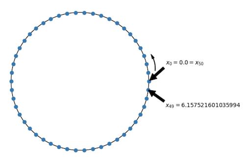

<h1 align="center">numgrids</h1>
<p align="center"> Working with numerical grids made easy.</p>

<p align="center"><a href="https://badge.fury.io/py/numgrids"> </a><a href=""> </a><a href="https://codecov.io/gh/maroba/numgrids"> </a></p>

  <div align="center">   </div>

**Main Features**

- Quickly define numerical grids for any rectangular or curvilinear coordinate system
- Differentiation and integration
- Interpolation
- Easy manipulation of meshed functions
- Using high precision spectral methods (FFT + Chebyshev) wherever possible
- Fully compatible with *numpy*

## Installation

```shell
pip install numgrids
```

## Quick Start

As a quick example, here is how you define a grid on the unit disk using polar coordinates.
Along the azimuthal (angular) direction, choose an equidistant spacing with periodic boundary conditions:

```python
from numgrids import *
from numpy import pi

axis_phi = Axis.of_type(AxisType.EQUIDISTANT, 50, 0, 2*pi, periodic=True)
```



Along the radial axis, let's choose a non-equidistant spacing:

```python
axis_radial = Axis.of_type(AxisType.CHEBYSHEV, 20, 0, 1)
```


Now combine the axes to a grid:

```python
grid = Grid(axis_radial, axis_phi)
```


Sample a meshed function on this grid:

```python
from numpy import exp, sin

R, Phi = grid.meshed_coords
f = R**2 * sin(Phi)**2
```
Define partial derivatives $\partial/\partial r$ and $\partial/\partial \varphi$ and apply them:

```python
# second argument means derivative order, third argument means axis index:
d_dr = Diff(grid, 1, 0) 
d_dphi = Diff(grid, 1, 1)

df_dr = d_dr(f)
df_dphi = d_dphi(f)
```

Obtain the matrix representation of the differential operators:

```python
d_dr.as_matrix()

Out: <1000x1000 sparse matrix of type '<class 'numpy.float64'>'
	with 20000 stored elements in COOrdinate format>
```


Define integration operator

$$
\int \dots dr d\varphi
$$

```python
I = Integral(grid)
```

Calculate the area integral

$$
\int f(r, \varphi) r dr d\varphi
$$

(taking into account the appropriate integration measure  $r$  for polar coordinates):

```python
I(f * R)
```

Setting boundary values to zero

```python
f[grid.boundary] = 0  # grid.boundary is boolean mask selecting boundary grid points
```

or to something more complicated:

```python
f[grid.boundary] = exp(-R[grid.boundary])
```

## Usage / Example Notebooks

To get an idea how *numgrids* can be used, have a look at the following example notebooks:

- [How to define grids](examples/how-to-define-grids.ipynb)
- [Partial derivatives in any dimension](examples/partial-derivatives.ipynb)
- [Polar coordinates on unit disk](examples/polar-cooordinates-on-unit-disk.ipynb)
- [Spherical Grid and the Spherical Laplacian](examples/spherical-grid.ipynb)
- [Solving the Schrödinger equation for the quantum harmonic oscillator](examples/quantum-harmonic-oscillator.ipynb)
