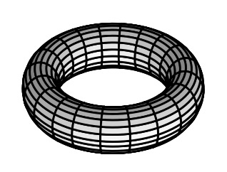

# numgrids  

[](https://badge.fury.io/py/numgrids)


Spectral methods for numerical grids in any number of dimensions supporting both non-periodic and periodic boundaries.

## Usage / Example Notebooks

To get an idea how *numgrids* can be used, have a look at the following example notebooks:

- [How to define grids](examples/how-to-define-grids.ipynb)
- [Partial derivatives in any dimension](examples/partial-derivatives.ipynb)
- [Polar coordinates on unit disk](examples/polar-cooordinates-on-unit-disk.ipynb)
- [Spherical Grid and the Spherical Laplacian](examples/spherical-grid.ipynb)
- [Solving the Schrödinger equation for the quantum harmonic oscillator](examples/quantum-harmonic-oscillator.ipynb)

## Installation

```shell
pip install numgrids
```
