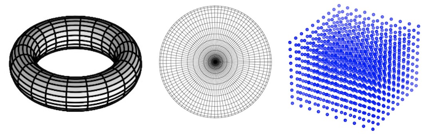

.. numgrids documentation master file, created by
   sphinx-quickstart on Mon Jul  3 13:43:54 2023.
   You can adapt this file completely to your liking, but it should at least
   contain the root `toctree` directive.

*numgrids* - Working with Grids Made Easy
=========================================

.. toctree::
   :maxdepth: 2
   :caption: Contents:

   getting_started.md
   api

